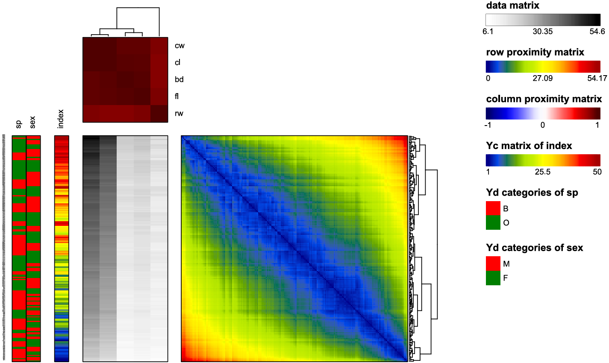

# GAPR

[](https://cran.r-project.org/web/packages/GAPR/index.html) 

GAPR is an R package implementing the generalized association plots (GAP) framework for exploratory data analysis (EDA). It combines efficient proximity computation, hierarchical clustering tree (HCT) and rank-2 ellipse (R2E) seriation, and tree-based flipping with an integrated visualization layout to reveal structural patterns in reordered data matrices. Core algorithms are optimized in C++ to ensure robust and efficient performance within the R ecosystem.

## Installation

```r
install.packages("GAPR")

# latest development version (only if newer available)
devtools::install_github("shuyyu/GAPR")
```

## Usage

```r
library(GAPR)

# Example using the crabs dataset from the MASS package
  CRAB_result <- GAP(
    data = MASS::crabs,
    YdNum = c(1,2),        # First two columns as Y discrete covariates
    YcNum = 3,             # Third column as Y continuous covariate
    row.name = c(1,2,3),   # Use First three columns as row names
    row.prox = "euclidean",
    col.prox = "pearson",
    row.order = "average",
    col.order = "average",
    row.flip = "r2e",
    col.flip = "r2e",
    original.color = 'Greys',
    border = TRUE,
    border.width = 1,
    row.label.size = 1,
    show.plot = TRUE
  )
```


`GAP()` provides flexible visualization and output options that allow users to customize the appearance of matrix layouts and manage exported results.

These options include:
- Color settings for all matrices
- Label size settings
- Export-related options (e.g., `exp.*`)
- PNG output configuration

## Other Functions

In addition to the main `GAP()` function, GAPR provides several user-accessible functions that can be used for specific analysis tasks:

- **Proximity computation**:  
  `computeProximity()` computes row-wise or column-wise proximity matrices using multiple distance or similarity measures.

- **Seriation and Flipping**:  
  GAPR supports multiple seriation methods, including the R2E algorithm via `ellipse_sort()` and several variants of HCT implemented through `hctree_sort()`.

- **Evaluation metrics**:  
  `AR()`, `GAR()`, and `RGAR()` are provided to quantitatively assess the quality of ordering results based on proximity structures.

## Further Information

  For detailed function arguments, additional examples, and advanced usage options, please refer to the package documentation:

- Function-level documentation: `?GAP`, `?computeProximity`, `?ellipse_sort`, `?hctree_sort`
- Full function index: `help(package = "GAPR")`
